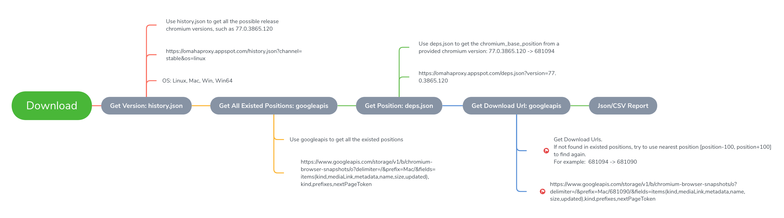

Chromium All Old Stable Versions
====================

List all possible chromium stable versions. Hope could be the help to you. :)

## Download Links

1. [chromium.stable.json](https://raw.githubusercontent.com/Bugazelle/chromium-all-old-stable-versions/master/chromium.stable.json)
2. [chromium.stable.csv](https://raw.githubusercontent.com/Bugazelle/chromium-all-old-stable-versions/master/chromium.stable.csv)

> Something you need to know: 
> 1. The [omahaproxy](https://omahaproxy.appspot.com/) only provides the chromium_**base**_position for main version. 
>    For example 77.x.xxxx.xx, the [77.0.3865.75 - 681094](https://omahaproxy.appspot.com/deps.json?version=77.0.3865.90), [77.0.3865.90 - 681094](https://omahaproxy.appspot.com/deps.json?version=77.0.3865.90), they have the same position 681094.
>    So, the chromium download urls for 77.x.xxxx.xx are the same.
>    Based on the [official document](https://www.chromium.org/getting-involved/download-chromium), seems no better solution to fix this.
> 2. Some of certain positions don't have the chromium build. To get chromium, get the nearest position from: [position-100, position+100]

## Command to install at Ubuntu

Here is the command for reference to install the Chromium at Ubuntu

```
CHROMIUM_VERSION=77.0.3865.120
wget --no-check-certificate https://raw.githubusercontent.com/Bugazelle/chromium-all-old-stable-versions/master/chromium.stable.json

# Parse the json
download=$(jq -r ".linux64.\"${CHROMIUM_VERSION}\".download_url" chromium.stable.json)
position=$(jq -r ".linux64.\"${CHROMIUM_VERSION}\".download_position" chromium.stable.json)
echo "download url is: ${download}"
echo "position is: ${position}"

# Download
wget --no-check-certificate -O chromium.zip ${download}
unzip chromium.zip
rm -f chromium.zip

# Configure the --no-sandbox and --ignore-certificate-errors
sed -i 's/\"$@\"/--no-sandbox --ignore-certificate-errors \"$@\"/' chrome-linux/chrome-wrapper

# Set to the system: assume the current folder is: /headless/
sudo ln -s /headless/chrome-linux/chrome-wrapper /usr/bin/chromium
```

## Download Process

1. Get Version: history.json

   Use history.json to get all the possible release chromium versions, such as **77.0.3865.120**

   https://omahaproxy.appspot.com/history.json?channel=stable&os=linux

   > OS: Linux, Mac, Win, Win64, Android
   
2. Get All Existed Positions: googleapis

   Use googleapis to get all the existed positions
   
   https://www.googleapis.com/storage/v1/b/chromium-browser-snapshots/o?delimiter=/&prefix=Mac/&fields=items(kind,mediaLink,metadata,name,size,updated),kind,prefixes,nextPageToken

3. Get Position: deps.json

   Use deps.json to get the chromium_base_position from a provided chromium version: **77.0.3865.120 -> 681094**

   https://omahaproxy.appspot.com/deps.json?version=77.0.3865.120

4. Get Download Url: googleapis

   Get Download Urls. If not found in existed positions, try to use nearest position [position-100, position+100] to find again.
   For example: **681094 -> 681090**

   https://www.googleapis.com/storage/v1/b/chromium-browser-snapshots/o?delimiter=/&prefix=Mac/681090/&fields=items(kind,mediaLink,metadata,name,size,updated),kind,prefixes,nextPageToken

   

## Build Process

Consider behavior takes time, use DockerHub to get chromium url.

And then push the chromium json files back to repo.

## Chrome (Not Chromium) Old/History Versions

1. Linux NPM Packages: http://orion.lcg.ufrj.br/RPMS/myrpms/google/

2. Linux DEB Packages: 

   Specific the version like: 77.0.3865.120-1. And download via: https://dl.google.com/linux/chrome/deb/pool/main/g/google-chrome-stable/google-chrome-stable_77.0.3865.120-1_amd64.deb

3. Linux Deb, Mac, Windows Packages: https://www.slimjet.com/chrome/google-chrome-old-version.php

## Something Else

The followings are something else when I doing the research.

It maybe the help for you be more familiar about Chromium.

1. Chromium Logs: https://chromium.googlesource.com/chromium/src.git/+log/76.0.3809.132/
2. Chromium DEPS: https://chromium.googlesource.com/chromium/src.git/+log/76.0.3809.132/DEPS
3. Chromium data, all in one place: https://www.chromiumdash.appspot.com/home
